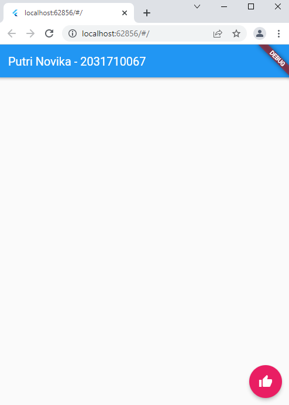

# basic_flutter

NIM : 2031710067  
Nama : Putri Novika Arini  
Kelas : MI-2C  
Prodi : D3-MI  

## Hasil Praktikum
### 1. Build in Widget
a. Text Widget

b. Image Widget

c. Material Design dan iOS Cupertino 

d. Button

e. Scaffold

f. Dialog

g. Input dan Selection Widget 

h. Date and Time Pickers

### 2. Build in Layout Widget 
a. Container Property Child

b. Container Property Alignment

c. Container Property Color

d. Container Property Height dan Width

e. Container Property Margin

f. Container Property Padding

g. Container Property Transform

h. Container Property Decoration

i. Column Widget

j. Row Widget 

k. Stack

l. ListView

m. GridView

### 3. Tugas

